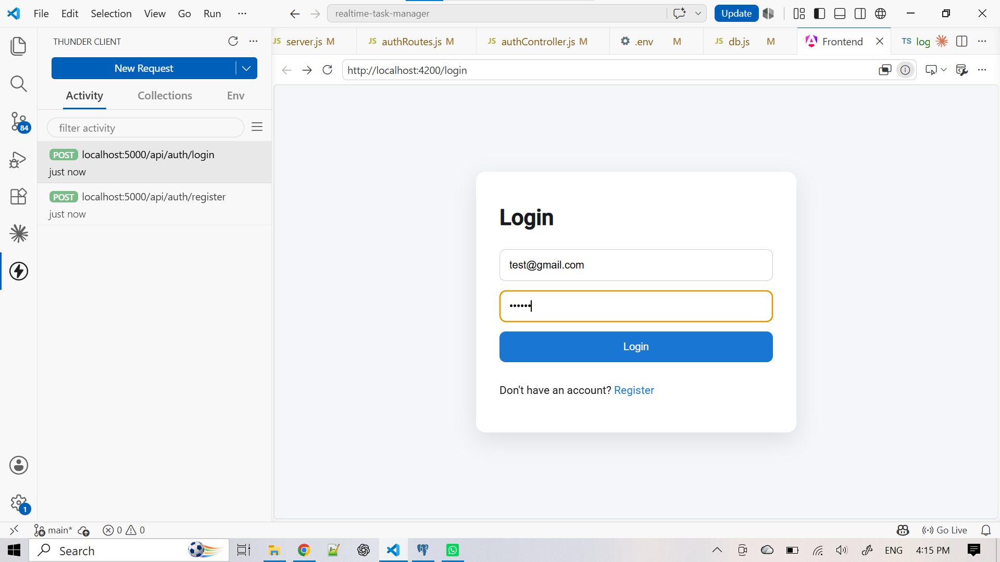

#  Real-Time Collaborative Task Manager

A full-stack **real-time task management system** inspired by Trello and Notion, built to demonstrate modern backend architecture, WebSocket communication, and collaborative workflows.

This project enables multiple users to manage tasks in shared boards with **instant live updates**, drag-and-drop organization, and real-time synchronization across clients.


## Live Features

* Secure Authentication (JWT-based login & registration)
* Workspace management (multi-team support structure)
* Boards (project-level organization)
* Columns (Kanban-style workflow)
* Tasks (create, update, assign, prioritize, delete)
* Real-time updates using Socket.io
* Multi-user collaboration in shared boards
* Live presence system (users connected to a board)
* Activity logging (track all actions per board)
* Drag & drop task movement (frontend integration)
* PostgreSQL relational database design


## 🛠 Tech Stack

### Backend

* Node.js
* Express.js
* Socket.io
* JWT Authentication
* PostgreSQL

### Frontend

* HTML5
* CSS3
* JavaScript (Vanilla)
* Socket.io Client
* SortableJS (drag & drop)


## Real-Time System Architecture

Frontend (Browser)
      ↓
Socket.io Client
      ↓
Node.js + Express Server
      ↓
PostgreSQL Database

This system uses **WebSockets (Socket.io)** to broadcast updates instantly to all connected users in the same board.


## Project Structure

realtime-task-manager/
│
├── server.js
├── package.json
├── package-lock.json
│
├── frontend/
│   ├── index.html
│   ├── style.css
│   └── app.js
│
├── src/
│   ├── config/
│   ├── controllers/
│   ├── middleware/
│   ├── models/
│   ├── routes/
│   └── sockets/
```


## 🚀 How to Run Locally

### 1. Clone repository

```bash
git clone https://github.com/your-username/realtime-task-manager.git
cd realtime-task-manager
```

### 2. Install dependencies

```bash
npm install
```

### 3. Setup environment variables

Create a `.env` file:

```env
PORT=5000

DB_HOST=localhost
DB_PORT=5432
DB_USER=postgres
DB_PASSWORD=your_password
DB_NAME=taskmanager

JWT_SECRET=your_secret_key


### 4. Run the server

```bash
node server.js
```

or (recommended)

```bash
npx nodemon server.js

### 5. Open in browser


http://localhost:5000


##  Key Learning Outcomes

This project demonstrates:

* Building scalable REST APIs with Express
* Designing relational databases with PostgreSQL
* Implementing authentication with JWT
* Real-time communication using Socket.io
* Managing multi-user state synchronization
* Full-stack application architecture
* Event-driven backend systems


##  Real-Time Features Explained

* When a user creates or moves a task → all connected users see updates instantly
* Users join specific board “rooms” using Socket.io
* Presence tracking shows how many users are online in a board
* Activity logs track all important actions


##  Future Improvements

*  Mobile responsive UI redesign
* Notifications system
* Email alerts for task assignments
* Live deployment (Render + Vercel)
* Role-based access (Admin / Member)
* Analytics dashboard


##  Author

**Built by:** Given Ramalivhana
 Computer Science Student (TUT)


##  Why This Project Matters

This project showcases:

* Real-world backend engineering skills
* WebSocket-based architecture
* Database design understanding
* Full-stack integration
* Collaboration system design

It is designed to reflect production-level thinking, not just CRUD operations.

